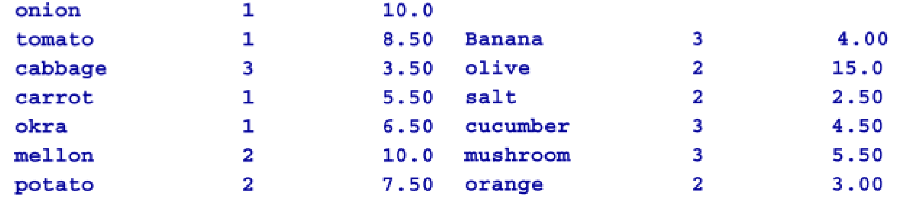
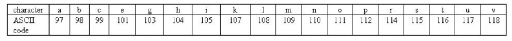
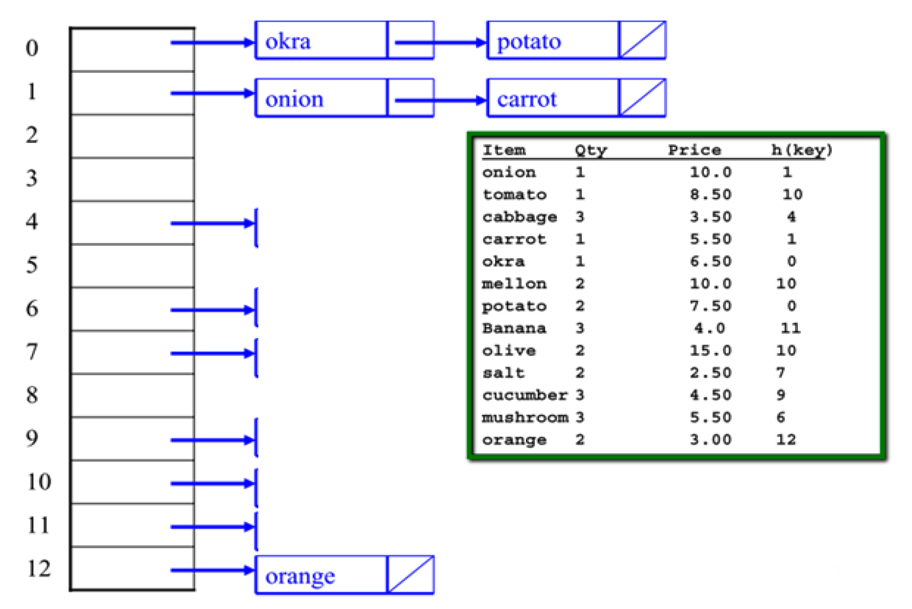

# Homework: Hashing and Conflict Resolution.
Name: Hyun Suk (Max) Ryoo

Computing ID: hr2ee

## Q1 Hashing and Chaining with String keys
Let’s assume the hash table size = 13

Use the hash function to load the following commodity items into the hash table:

Will use ASCII code for the characters as follows:

For instance:

hash(onion) = (111 + 110 + 105 + 111 + 110) % 13 = 547 % 13 = 1

hash(orange) = (111 + 114 + 97 + 110 + 103 + 101) % 13 = 636 % 13 = 12

Complete the diagram below using the Chaining collision resolution technique:

Will use ASCII code for the characters as follows:

## Solution

From the diagram above we are given the item, qty, price, and h(key). The h(key) for the result of the hashfunction. If we were not given this information we will need to compute all the h(key) function. However, since we are given this data we will use it as a source of truth and showcase only the chaninig collution resolution for the objects. 

One other aspect is the qty column. For this excercise I will treat the qty as the number of objects this object is repeated. For example if apple has the qty of 2 in the array of [(cheese, 1), (apple, 2), (cake, 1)], this will be interpreted as [cheese, apple, apple, cake].

The point of chain collision is to link the elements that collide with one another. I will represent the data structure of link list with the $\rightarrow$ notation. 

| h(key)  |  Items |
|---|---------------------------------------------|
|0|okra $\rightarrow$ potato $\rightarrow$ potato|
|1|onion $\rightarrow$ carrot|
|2||
|3||
|4|cabbage $\rightarrow$ cabbage $\rightarrow$ cabbage|
|5||
|6|mushroom $\rightarrow$ mushroom $\rightarrow$ mushroom|
|7|salt $\rightarrow$ salt|
|8||
|9|cucumber $\rightarrow$ cucumber $\rightarrow$ cucumber|
|10|tomato $\rightarrow$ mellon $\rightarrow$ mellon $\rightarrow$ olive $\rightarrow$ olive|
|11|banana $\rightarrow$ banana $\rightarrow$ banana|
|12|orange $\rightarrow$ orange|

If we were to assume that the qty column is non informative and each element can be viewed as one instance, the table will be the following. 

| h(key)  |  Items |
|---|------------------------------------|
|0|okra $\rightarrow$ potato|
|1|onion $\rightarrow$ carrot|
|2||
|3||
|4|cabbage|
|5||
|6|mushroom|
|7|salt|
|8||
|9|cucumber|
|10|tomato $\rightarrow$  mellon $\rightarrow$ olive|
|11|banana|
|12|orange|

## Q1 Hashing and Linear Probing

Given this hash table’s initial configuration: (Note: size of table = 13, “E” = Empty state)

| Index  |  Status | Value |
|---------------|---------------|---------------|
|0|E| |
|1|E| |
|2|E| |
|3|E| |
|4|E| |
|5|E| |
|6|E| |
|7|E| |
|8|E| |
|9|E| |
|10|E| |
|11|E| |
|12|E| |

1. Perform the operations in the table below showing the following two things after each operation:
   * The hash index or the probe sequence if necessary
   * A comment “Collision” / “Success” / “Fail” to indicate the appropriate event*
2. Show the final hash table after all the operations have been performed

## Solution

The first operation has been done for you:

| Operation  |  Index of Probe Sequence | Comment |
|------------|---------------------|------------------------------|
Insert(18) | h0(18)=(18 % 13) = 5 | Success |
Insert(26) | h0(26)=(26 % 13) = 0 | Success |
Insert(35) | h0(35)=(35 % 13) = 9 | Success |
Insert(9) | h0(9)=(9 % 13) = 9 | Collision - Resolved at Index 10 |
Find(15) | h0(15)=(15 % 13) = 2 | Failed |
Find(48) | h0(48)=(48 % 13) = 9 | Collision/ Failed (Collsion - Failed at index 11, which was empty) |
Find(9) | h0(9)=(9 % 13) = 9 | Collision (Resolved at index 10) |
Insert(64) | h0(64)=(64 % 13) = 12 | Success |
Insert(47) | h0(47)=(47 % 13) = 8 | Success |
Find(35) | h0(35)=(35 % 13) = 9 | Success |

Status of hash table

| Index  |  Status | Value |
|---------------|---------------|---------------|
|0|O| 26|
|1|E| |
|2|E| |
|3|E| |
|4|E| |
|5|O| 18 |
|6|E| |
|7|E| |
|8|O| 47|
|9|O| 35|
|10|O| 9|
|11|O|  |
|12|O| 64|

## Q3 Additional questions
1. Name one advantage of Chaining over Linear Probing.
   * One advantage of chaining is the flexibility of chaining. For a certain index, the value will be a data structure such as a link list that can store all the values as long as memeory allows. Lets say our hash function is bad and that all values hash to index 1 in hash table of size 10. If we have 30 keys we need to hash we will be able to store all the elements in index 1 with chaining while for linear probing we will run out of space. Also, we can see that in linear probing there is a tendency for the values to be clustered because linear probing will simply populate the next index. 
2. Name one disadvantage of Chaining that isn’t a problem in Linear Probing.
   * One disadvantage is the use of a datastructure for chaining. In Linear Probing we will simple linearally search the table with constant look up time while for chaining this may not always be constant. 
3. If using Chaining, how can finding an element in the linked list be made more efficient?
   * One option may be to use a sorted link list. You could utilize the tortise and hare method to find the midpoint and endpoint of the link list to do a binary search like opertaion to find the element needing search. However, this can be very costly and in the worst case will have the sample complexity as a linear search of the linked list. Another option may be to use a doubly linked list, which will help possibly in deleting, but may not be a huge improvement interms of searching. 
4. Why does Linear Probing require a three-state (Occupied, Empty, Deleted) “flag” for each cell, but Chaining does not? You may use an example as an illustration to your argument.
   * This is because the nature of linear probing to be linearly searching for an empty space. Let's say that we had for (index, state, value) [(0, E, ''), (1,E, ''), (2, E, '')] and that our hash function will always give the index of 1. If we insert three elements (1,2,3) our hashtable will be [(0, O, '0'), (1,O, '1'), (2, O, '2')]. Now we will delete 2 form the hashtable. If we do **not** have the deleted flag our hashmap will be the folliwng. [(0, O, '0'), (1,E, ''), (2, O, '')]. Lets say now we want to find 2. We will start at the index 0 and linear prob to index 1 which is empty and our ouput will be '2' not found. If we use the deletion marker we will be able to continue our search since index 1 will be deleted and not empty. In Chaining this is not needed because we will linearly search all elements until an element is found or we are at the end of the link list. 
