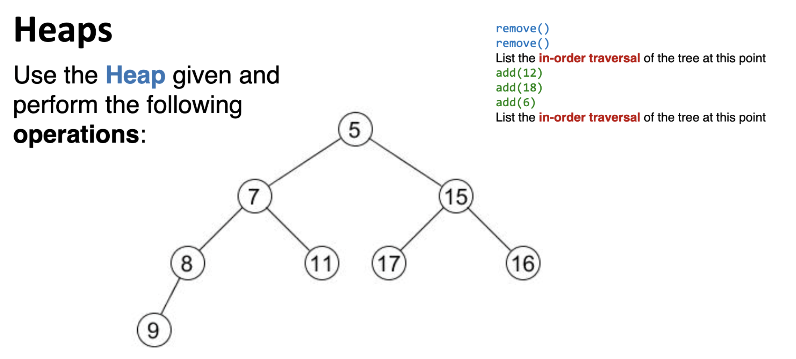

# ICA 5
Name: Hyun Suk (Max) Ryoo

Activity Name: Binary Heaps

Computing ID: hr2ee

**Inorder**:
Left $\rightarrow$ Root $\rightarrow$ Right

## Q1

remove()

remove()

In-order traversal of the tree after two removes.

* 16, 9, 11, 8, 17, 15 

add(12)

add(18)

add(6)

In-order traversal of the tree at this point.

* 18, 9, 16, 8, 11, 6, 17, 12, 15

