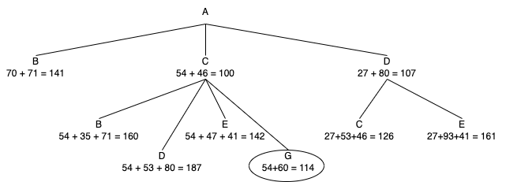

# ICA 6
Name: Hyun Suk (Max) Ryoo

Activity Name: A* Example: Travel from Washington D.C. to Richmond, VA

Computing ID: hr2ee

Given the assumption that going from A to B, the algorithm will know to not go back to A the diagram is as shown.

We can see from A* that A -> C -> G is the shortest path to Richmond, Va. The reason we don't expand A -> D -> C or A -> D -> E is because we already know that these paths are more expensive. This is the same reason A->B stops since the cost is already at 141. 

